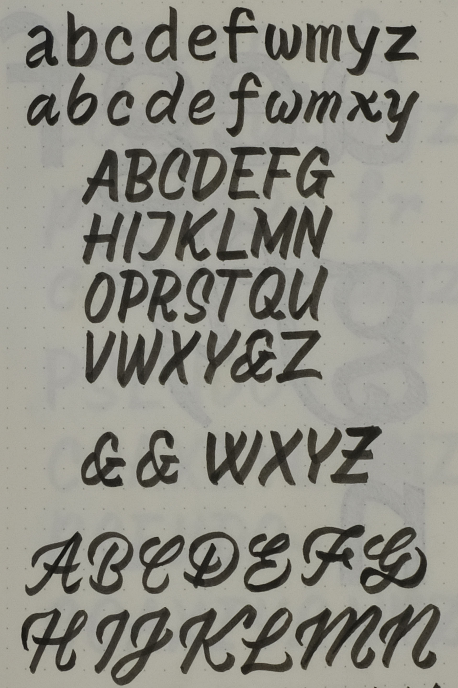
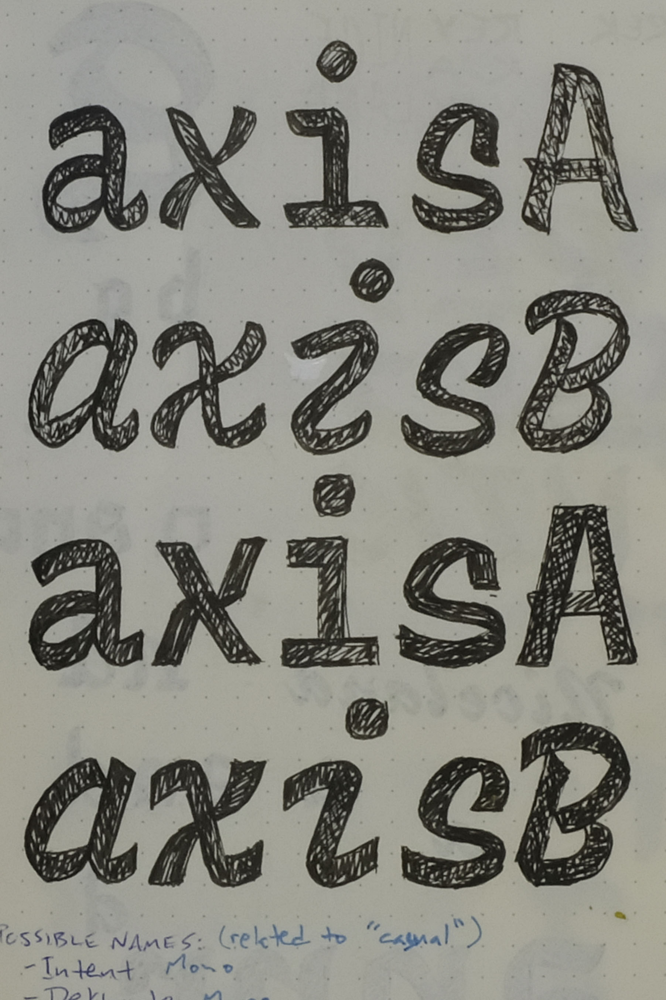
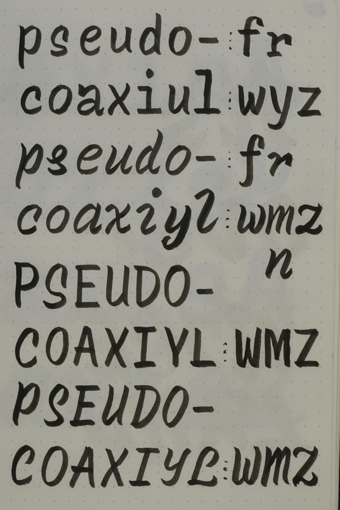

 # Recursive Process & Origins

 _Recursive is a variable font[1] family for code & interactive design. It takes its initial inspiration from single-stroke casual signpainting, but extends this style into a wide-ranging designspace[2] to deliver advanced typographic control & flexibility. Started as a thesis project at KABK TypeMedia in 2018, it was later commissioned for open-source release by Google Fonts. It has since been extensively expanded and refined for release in late 2019._

The Recursive project has been driven by three overarching goals:

1. Making something fun & useful for web design & development
2. Unocovering what a "single-stroke casual" for code & user interfaces (UI) could be
3. Contributing to variable font design workflows, technological support, and user adoption

With these goals in mind, here is the story of Recursive.

[1] A *variable font* is a font that combines a range of font styles into a single file, and this stylistic range can be controlled by the user of the font. By contrast, typical digital fonts (known as *static fonts*) have a single style per font file, and these are strictly separated from one another. Whereas a static font family might have a Regular, Medium, SemiBold, and Bold styles, a similar variable font family would have the styles, plus *anything in between.* This has many benefits, including increased typographic control and the potential for reduced overall file size on the web.

[2] The *design space* of a typeface is its total possible area of stylistic possibilities. In variable fonts, the design space is often represented as geometric shapes such as a rectangle or a cube, to visually plot the relationship of axes and show the available stylistic range.

## The origins of Recursive

Before shifting my focus to type design, I studied graphic design, then worked as a designer at IBM for 3 years. There, I worked first as a digital product designer, and later as a brand experience designer. My primary focus was on the visual design and user experience of web-based applications and marketing. Over my time in these roles, I shifted more and more towards using web code to prototype and implement design.

Working in these roles, I was particulary focused on typographic clarity and microinteractions[1]. I picked up on details in fonts that worked – or didn't – for interactive interfaces. Initially, I was designing UI with Helvetica Neue. Helvetica has some wonderful qualities, but I found a few primary problems:

1. The closed apertures (openings in letters like `a`, `e`, and `s`), overly-similar shaping (`I` vs `l`, `6` vs `8` vs `9`, and so on), and tight spacing of Helvetica make it a beautiful font for use in marketing or relatively large text, but my teams were creating UI that required small type and presented rich, complex data. Readability[2] and legibility[3] were never as optimal as I wanted them to be.

2. Our version of Helvetica lacked tabular figures (numbers that take up the same width, across font styles), which was especially problematic for the complex financial data in one of my main projects. At this time, many teams at IBM started using monospace fonts for such data, but there wasn't an obvious option for which monospace font should be used. Pairing fonts effectively can be difficult in general: there is the subjective challenge of finding complementary styles, plus the technical challenge of harmonizing layout when proportions and metrics vary from font to font.

3. Different styles of Helvetica (or of almost any font) take up different amounts of space. That is, a word set in the Regular weight is narrower than the same word set in Bold. This normally isn't a typographic problem, and in many cases helps different styles to work in visual harmony with one another. However, it makes it impossible to elegantly use font style changes for user interactions. If we tried to make a hovered menu item or link Bold on hover, it would change its width. At best, this would look kind of janky, and at worst, it could break a layout. Therefore, with most fonts, iteraction must be shown through color changes or visual changes in elements other than type.

Today, the first problem has been largely solved by Helvetica Now, which has specific styles for small text. The first *two* problems were solved at IBM by commissioning IBM Plex, a superfamily[4] of Sans, Mono, and Serif fonts. However, neither of these are optimized for solving the third problem. Like the vast majority of fonts, neither Helvtica Now nor IBM Plex are built to enable graceful transitions between font styles.

[1] *Microinteractions* are subtle but important ways to communicate interactivity to a user. They are typically animated. When applied well, help to make an interface more intuitive and pleasant to use. A simple example of a microinteraction is a button that tranisitions from light to dark blue on hover, to indicate that it can be clicked.

[2] *Readability* is the overall ease with which a body of text can be read. This is affected by such things as the sizing, even spacing, and color contrast of text, as well as the appropriateness of the font used for a given size and medium. A font with thin stroke thickness or tight letterspacing might be readable and appealing at large sizes, but can easily make smaller text harder to read.

[3] *Legibility* is the ease with which different characters can be distinguished from one another. Highly-legibile characters are most important in contexts where ambiguity causes problems, such as passwords, code syntax, data display, and UI elements. It is less vital in running text, where readability is the higher priority.

## TypeMedia

On the side of working at IBM, I developed a personal practice of lettering, calligraphy, and type design. I found little ways to work these interests into projects at work, but mostly, it was just a fun way to spend my time and explore the broader world of design.

One of my main interests in lettering was starting ideas with handwritten brush lettering and taking these into carefully-drawn lettering. The process of simplifying the textural, organic writing into specific, black-and-white outlines is challenging but satisfying, and connected well to my long-term interest in logos and type design.

After years of dreaming about it, I finally made it into a masters program for type design, TypeMedia, at the Royal Academy of Arts in The Netherlands. I was one of twelve students from around the world who were lucky enough to study under some of the best type designers in Europe for 10 intensive months. 

The first semester of TypeMedia is a broad survey of approaches to type and letter design, covering topics including type revival, Python, stone carving, Arabic script, and the formal construction of different styles of type. In the second semester, each student created a single type design project to work on for 5 months, and pursued this under the frequent reviews and critique from our teachers.

Of course, choosing a thesis topic requires a lot of thought. My classmates and I were often told to embrace a project that would be weird and ambitious, forgetting notions of making something to immediately define and sell. We had 5 months to dedicate ourselves completely to a project, and that is a very rare opportunity. One alum told us, "now that variable fonts exist, I would approach the thesis completely differently." They left it up to us to imagine just *how* we should approach it differently, and that was the point. We weren't supposed to get answers from those before us; we were supposed to seek our own.

With these prompts, I sketched ideas for my thesis. A direction I kept coming back to was a single-stroke casual.

## An origin in painted letters

_Single-stroke casual_ is a genre of signpainting which is often the first style taught to beginner signpainters. Each signpainter has their own version of it, but it adheres to some typical attributes: 

- Letters are constructed from a limited set of simple-to-paint, gently-curved strokes. Each segment of a letter is painted as a single stroke rather than built up from multiple brush strokes (as is sometimes the case for other, more-complex signpainting styles).
- Letters usually written with a slant.
- Letters are usually uppercase.
- Letters often have a low-waisted construction, with crossbars placed below the optical middle. This deliberately casual design makes the style visually forgiving to write, because there is no formal basis for how letters "should" look.

These attributes work together to make a style that is simple to learn, visually forgiving, and efficient to paint. As a result, this is a style in widespread use, and tends to convey an approacheability 

Drawing casual letters made me realize that I could squish and stretch them wildly, and they still held up their energy and sense of vitality. With a brush pen, I was free to easily explore many atypical styles: super-bold, ultra-condensed, ultra-wide extra-swashy, and more. I found that a single-stroke casual basis lent itself to a very flexible design space.

While sketching, I also found myself drawn towards monospaced letters.

I love coding for what it allows me to do as a designer. However, I have to admit: I also love the aesthetics of it. I love that a programmer's primary interface is type, with little else. On a micro lebel, I particularly like the way that monospaced type creates a tabular rhymtm by compressing some letters (narrow `w` and `m`, etc) and extending others (slab-serifed `i` and `l`, etc). So, of course, I also started sketching single-stroke casuals as fixed-width letters.

Not only was I seeking to find my own style of casual letters, but I was also searching for a way to make a more readable, more widely-usable style. Often, if casual caps are paired with a lowercase, the lowercase letters are written as a connected script. To make my project appropriate for use in code & UI, I needed to make a lowercase that was a more-typical Roman[4] construction rather than a connected script. Additionally, I wanted to create letters that weren't simply a traced facsimile of signpainted letters, but which were more "typographic" – simplified in visual style in order to be elegantly usable in many situations, including for small text on screens.

[4] *Roman* letters are the letters we are most used to seeing in Latin-script fonts and "print" style handwriting. Each letter is separate from the next, and each has what we tend to think of as its most-basic form. Helvetica and Times New Roman are just two examples of fonts with Roman upright styles.

## Finding the voice of Recursive

Initial prototyping

Keeping a standard width metric for elegant fallback fonts.

- Early digital drawings. Searching for something both expressive and simple/typographic. Tried to explore this by making something too wild, and something too rigid. Realized that having a spectrum was more interesting than finding just one thing in the middle. I recieved some excellent feedback from a couple of type designers I look up to especially, and this gave me a boost of ideas to refine the letterforms – making them wild but not _too_ wild, and straightforward but not naïve.

### Playful or serious? Yes.

### From a "triospace" to a grid-based Sans

### Working through technical difficulties

The concept & design of Recursive is rooted in the idea that every stroke of every letter should come from what a signpainter could produce with a brush. This approach enabled me to explore a system that could morph in proportion, expression, weight, and slant, but still remain cohesive and tied to its initial inspiration. Not only was Recursive conceptually based on this approach, but the shapes were drawn by following this concept quite literally. For the entirety of TypeMedia, I drew each glyph with multiple, separate contours for each "brush stroke" – a significantly different approach from the more-typical style of drawing digital type with interior contour overlaps left only for efficiency.

[IMAGE OF SKETCHES WITH SEPARATE CONTOURS]
[IMAGE OF EARLY BEZIER DRAWING WITH SEPARATE CONTOURS]

Near the end of TypeMedia, I discovered a major problem with my drawing approach: it resulted in rendering issues on screens. Where strokes overlapped, rasterizes would often "double up" the pixel darkness, giving some letters a blobby look. It was difficult to accept that this would have to be changed, both because it would be very labor-intensive to change all my drawings, and also because I felt that my concept would be diluted by removing the overlaps. However, to make the best-quality end product, my concept had to be adjusted. Luckily, I had help in adjusting my drawings, and the rework was actually beneficial in helping me to more fully consider how the final design ought to be. 

[SCREENSHOT OF BLOBS]

Even though the overlapped drawings ultimately required more work than expected, this unique approach helped me to create shapes that I may have otherwise missed. I definitely won't draw most fonts like this in the future, but if the right project calls for it, I may return to the idea again.

## Refining & finishing the project for release

## Workflows & Tooling

### MasterTools

### Glyph Mirror

### Var Font Prep & "homemade" scripts

### Type-X

## Get involved!

### Browser bugs

Please go support the browser issues for 

### Kickstarter

### Contributing to the project

File bugs & PR on the GitHub repo.

## The team

Recursive wouldn't have been possible without the mentoring, critique, and contributions from many designers and developers. The original thesis project recieved input not only frequent critique & advice from TypeMedia teachers, but also from type designers who visited or were kind enough to look at proofs during RoboThon and TypoLabs conferences. Tools built by Rafał Buchner and Roel Nieskens were vital to the design & testing workflow. In 2019, type design, refinement, and production was greatly assisted by contributions from Katja Schimmel and Lisa Huang. Ben Kiel has provided expert mastering for production fonts. Marketing was made possible by the design work of Math Practice, the web development by Talia Cotton, and greatly improved by the design feedback of Irin Kim and writing assistance from Noemi Stauffer. Finally, making this project a reality was made possible by the support of Dave Crossland and the engineering efforts of Google Fonts.
