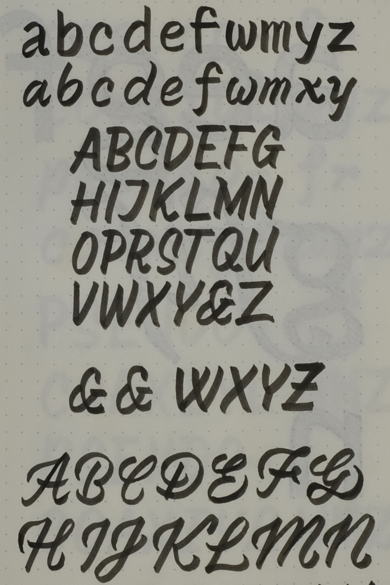
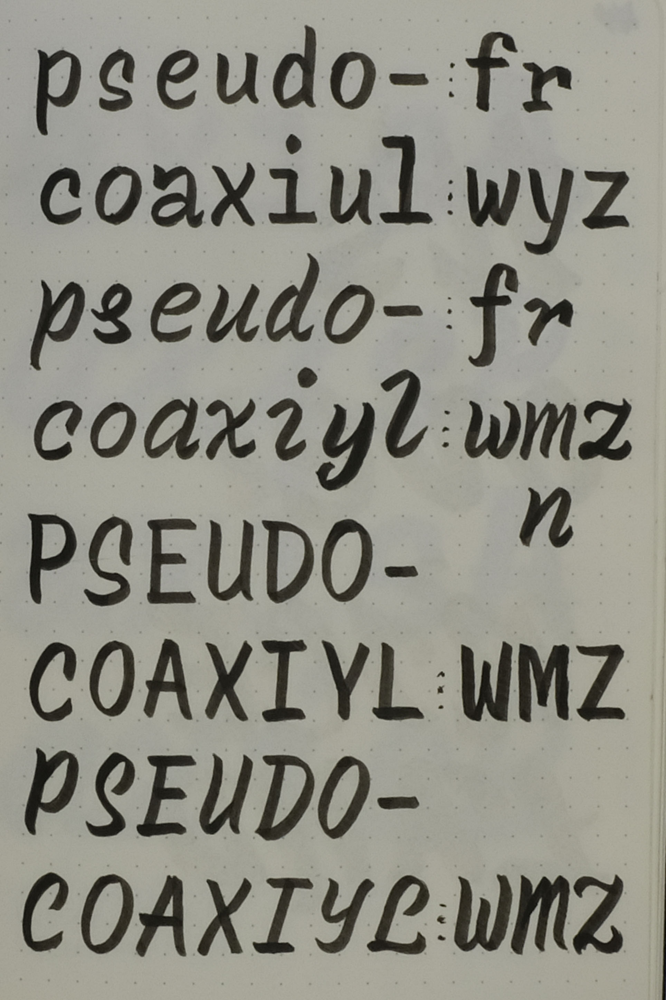

# Recursive: Origins & Process

_Written by Stephen Nixon_
_Edited by Noemi Stauffer_

## A typographic pallette for code & UI

Recursive is a type family made primarily for use in programming and software user interfaces. Its letterforms are inspired by single-stroke casual signpainting but simplified in order to allow effective, highly-legible usage in text sizes, with a special focus on providing typographic flexibility and expressive range on screens and on the web. It has been built as a _variable font_[1] from the start, and its design takes creative advantage of this leap forward in font technology.

    [1] A **variable font** is a font file that includes multiple typographic styles, allowing selection between these styles. By comparison, most traditional digital fonts are _static fonts,_ which only include a single, unchangeable style per file. The most obvious benefit of variable fonts is filesize reduction. Other benefits include fine-grained design control and the ability to transition smoothly between styles.

Recursive was first conceived & designed as my thesis project at [TypeMedia](http://typemedia.com) 2018, a one–year Masters course in type design at the Royal Academy of Art (KABK) in The Netherlands. This year, Google Fonts commissioned the completion of the project for release under the _SIL Open Font License_[2]. 

    [2] The **SIL Open Font License** (OFL) allows anyone to use a typeface freely in their projects. This goes beyond the font being available at no cost, but also allows users to modify it as needed, or evern adapt the components for completely new typefaces. One of the few restrictions for an OFL typeface is that fonts that start as modified versions of it must also be released under the same OFL license. [read the license](link here to recursive OFL license)

## Project goals & approach

The Recursive project has been driven by three primary goals. With it, I seek to:

1. Make something that can provide the most utility (and fun) to developers and designers.
2. Explore what is possible with variable fonts – beyond the usual "weight, width, and filesize saving" aspects that tend get the most attention.
3. Chase a personal curiosity: what might a "single-stroke casual" for code & digital design look like?

So far, Recursive has received over 10 months of intense, full-time focus from me, as well as more than 4 months of combined effort from collaborators (not counting auxilary projects like this specimen website). It is a complex project. Typical digital type families are a series of individual font files, which might have the four "RIBBI" styles (Regular, Italic, Bold, Bold Italic). Fonts that are more elaborate may have extra font weights generated as interpolations of a slightly-wider range drawn in four or six "master" source files. Recursive, meanwhile, is built from 24 font masters, which are compiled into a single, ultra-flexible variable font file with 5 stylistic axes. Of course, it also includes carefully-planned _named instances_[2]

    [2] **Named instances** are pre-defined styles of a variable font. They allow a variable font to be used just like familiar type families of static fonts. In design programs like Figma or Adobe Illustrator, named instances are accessed through the font style menu, and typically include styles like "Regular," "Italic," "ExtraBold Italic," and so on.

The Recursive project has been managed in Git version-control software from the start. In that time, Recursive has received nearly 2,000 commits from 5 contributors (and it's still not quite done, yet!). The project has been much more than just drawing letters, however. Modern-day type design is a surprisingly multi-discliplinary field in which practicioners commonly split their time between drawing type, graphic design, and programming (mostly with Python).
 
Throughout this type project, I coded as a way to automate repetive workflows, generate test proofs of work-in-progress, check source files for quality, build design files into working variable fonts, and use the output fonts in web experiments. Along the way, I used the then-current versions of Recursive Mono as my primary font in code editors. This, in turn, was a way to test the font itself, finding what worked (and what didn't) in the design as I worked with it. By using the font outputs as a tool to produce the font, I was working _recursively_[3] – using outputs as inputs to achieve a result that would have otherwise been impossible.

    [3] In computer science, **recursion** is a problem-solving technique in which functions call themselves. 

## An aside on naming

"Recursive" names are surprisingly common in technology: PHP is _**P**HP: **H**ypertext **P**reprocessor_, GNU is **G**NU's **N**ot **U**nix, [and so on](link to Wikipedia's list of recursive names in computer science). Instead of coming up with a "recursive" name for my computer-oriented "cursive" font, I realized that the name _Recursive_ was a good fit, already. Recursive is not technically _cursive,_ because a truly-connected script would not be particularly readable in code or application interfaces. Yes, I explored this. 

[IMAGE: monospace cursive](Fun to look at – hard to read)

## My background

Ultimately, Recursive has been a way to explore & combine several things I love: beautiful letterforms, web design & development, and font technology.

I grew up in South Dakota. It was a beautiful place to grow up, but not exactly an epicenter of design. I've been drawing letters ever since first learning about them, but wasn't until a high school art class that I realized graphic design was an actual career possibility. I eventually went to the University of Minnesota for Graphic Design. In college, it was a similar revelation that type design itself was a career and that educational programs like KABK TypeMedia existed.

During my time at the UMN, I studied a wide range of subjects in graphic design, but leaned most into typography and technology classes. For my senior thesis, I designed a type family, Warehouse, based on the historical signage in downtown Minneapolis. This typeface took inspiration from two main forms of lettering in ghost signage – one part of the family was  "Warehouse Gothic," with shapes similar to many classic sans-serifs designs, while a complementary part of the family was "Warehouse Square," which had letters that were rectangular with rounded corners. To distribute Warehouse and two other display fonts I had made as side-projects, I designed and built a website (which is miraculously [still available on the Internet Archive's Wayback Machine](https://web.archive.org/web/20170720054923/http://www.fourthfloorfoundry.com/index.html)). In some ways, Warehouse was a precursor to Recursive. 

There are easily-spotted similarities: Warehouse takes inspiration from painted signage, and has one side with generally-round letters, and another side with generally-square letters. More importantly, however, with Warehouse I was exploring how a single type superfamily[1] might allow designers to easily pair different font styles to create rich and compelling typography.

    [1] Whereas a type family is a set of related individual fonts – such as Regular, Italic, Bold, and Bold Italic, a type **superfamily** is a set of related type families – such as a sans-serif type family that is made with deliberate similarities to a serif type family. 

### On pairing typefaces

As a graphic designer, I am often drawn to compositions that use multiple typefaces. However, I have a confession to make: I've always found it a bit of a confusing challenge to pair different typefaces for a design. There are two primary problems to solve: 

- First, there is the problem of selection. What makes a successful combination of typefaces? Similar (or complementary) historical references? The same (or complementary) type designers? The overall shaping of letters? Some hard-to-define "vibe" of the fonts? All of these approaches have their merits, but it can be totally perplexing to feel confidence in a choice – especially for folks approaching the challenge for the first time.

- Second, there is the problem of actually using two or more typefaces together. Typefaces have no set standard for the relative heights of uppercase or lowercase letters, or even of overall sizing. That is, a font size such as "12 points" will have very different body size and line spacing from font to font. In a complex typographic context like a magazine, a website, or an application user interface, this can add significant complexity to the set of styles required to set text harmoniously.

For these reasons and more (such as font availability and licensing consistency), type superfamilies can be very appealing for graphic and interactive design. If a superfamily is made with compatible metrics in addition to harmoniously-designed styles, they can allow designers to make rich, expressive documents, saving them a large amount of work in finding visually-compatible fonts and then making these work together in a system.

## The limitations of traditional digital fonts on the web and in software 

Before TypeMedia, I worked as a visual designer for software and a brand experience designer, principally for the web.

While designing software, my longest-running project was making financial dashboards. My team was bound by product design guidelines to use Helvetica Neue. Over time, I grew to understand its strenths and weaknesses. Its tight spacing and small apertures made it hard to read at small sizes, its default figures weren't tabular and so it was hard to use in data-heavy tables. I didn't have a matching monospace font to work with, so even if I did want to use a monospace font for tabular data or to present strings like passwords, these wouldn't match the sizing or style of our primary type. As a visual designer, I often wanted to show the user what items were interactive or currently-selected, and I found that if I used type style as one signifier, the word shapes and line lengths would get interupted. That is, Bold text took more space than Regular text, so it looked a little off to bold text as a selected state, and _really_ janky to do so as a hover state.

Once I started to make Recursive, it was these problems that I had in mind.

## Why make a font for code?

I see myself as a designer more than a developer, but I again and again, I find that code is an excellent tool for design and productivity. In web projects, I am much more effective as a teammate when I can write code and PR this to a developer. In type, there are many repetitive workflows that can be automated in relatively simple ways with scripting. 

Aside from finding code to be a useful tool for design, I simply love to code.

I have a special love of the web – especially the people, communities, and philosophies of web development. I love the many fun, warm-hearted resources for people wanting to grow as web developers – sites like CSS Tricks and MDN, tools like CodePen and CodeSandbox, frameworks like GatsbyJS, and podcasts like Syntax FM, Toolsday, and ShopTalkShow. I love that by and large, web development is a welcoming field, embraces experimentation, and strives to keep user needs as the basis of how things work.

Therefore, with Recursive I was "scratching an itch" in making myself a font that I found as nice as possible to code with. However, I was especially seeking to make something that would allow me to contribute something back to the web development community. I wanted it to be as fun, warm, and experimental as my favorite parts of the field, and of course, I also wanted it to be as useful as possible.

## What is TypeMedia?

TypeMedia is a yearly program that brings together 12 students from around the world focus on many aspects of type design. In the first semester, classes cover topics like type revival, stonecarving, creating original type families, and coding in Python to produce & test type. In the second semester, each student focuses on a thesis project and develops this with regular feedback and critique from professors, peers, and visiting designers. 

This "pressure cooker" of a course is an intensive 10-months, but this environment has helped produce many amazing type designers and original typefaces. Many of the designers who lead TypeMedia studied under Gerrit Noordzij, a type designer & educator who elegantly described a theory that different forms of writing can be the basis of original & flexible type systems. Because of this legacy, many of the typefaces produced as TypeMedia thesis projects have a connection to calligraphic forms of writing. 

The teachers that lead TypeMedia are themselves accomplished type designers, who have contributed greatly to the theory and technology of the industry. They do a great deal to pass on their knowledge to students and to help students explore and learn for themselves – and I attended the program at a good time to do just that. Variable fonts are a relatively old idea (there was a similar technology on Mac computers in the early 1990s[2]), but they have only really been standardized and gaining wide support within the past few years. My class of TypeMedia was one of the first or second for which the technology was actually feasible to design for, so several of my classmates and I dove into the topic to explore how we could make projects to explore the expanded outer limits of fonts.

    [2] **Multiple masters** were...... citation needed

Recursive comes from my experiences as a designer, wishing for a typeface that just worked *better* in software. It is my effort to make something new, useful, and fun for the web development community. Recursive comes from my love for brush lettering and the diverse signage of NYC. Recursive comes from TypeMedia, where it was a way to explore both the theory of type from handwritten strokes and the technological advances in type design.

## Single-stroke Casual

Aside from software design and web development, I also have a great love for lettering and calligraphy. Before TypeMedia, I spent a lot of time learning about and practicing these skills. To me, one of the most fun challenges in lettering is to take something written in an organic way – often with a brush – and refine it into something with better shaping, spacing, legibility, and simplicity of form. This practice translates well into drawing type, because type often just takes this process of refinement and brings drawings or ideas into an interchangeable system of glyphs. 

At TypeMedia, we were often told to embrace a thesis project that would be weird and ambitious, forgetting notions of making something to immediately define and sell. We had 5 months to dedicate totally to a project, and that is a very rare opportunity. One alum told us, "now that variable fonts exist, I would approach the thesis completely differently." They left it up to us to imagine just *how* we should approach it differently, and that was the point. We weren't supposed to get answers from those before us; we were supposed to seek our own.

With these prompts, I sketched ideas for my thesis. A direction I kept coming back to was a single-stroke casual.

_Single-stroke casual_ is a genre of signpainting which is often the first style taught to beginner signpainters. Each signpainter has their own version of it, but it adheres to some typical attributes: 

- Letters are written with a limited set of simple-to-paint, gently-curved strokes.
- Letters usually written with a slant.
- Letters are usually all-capitals.
- Letters often have a "low waisted" construction, with crossbars placed below the optical middle.

These attributes work together to make a style that is simple to learn, visually forgiving, and efficient to paint due to its single-stroke construction (as opposed to more-formal styles that require more finely-placed, combined strokes for each letter).

Drawing casual letters made me realize that I could squish and stretch them wildly, and they still held up their energy and sense of vitality. With a brush pen, I was free to easily explore many atypical styles: super-bold, ultra-condensed, ultra-wide extra-swashy, and more. I found that a single-stroke casual basis lent itself to a very flexible "design space."[3]

    [3] The **design space** of a typeface is its total possible area of stylistic possibilities. In variable fonts, the design space is often represented as geometric shapes such as a rectangle or a cube, to visually plot the relationship of axes.

I love coding for what it allows me to do. However, I have to admit: I also love the aesthetics of it. I love that a programmer's primary interface is type, with little else. On a micro lebel, I particularly like the way that monospaced type creates a tabular rhymtm by compressing some letters (narrow `w` and `m`, etc) and extending others (slab-serifed `i` and `l`, etc). So, of course, I also started sketching single-stroke casuals as fixed-width letters.

In TypeMedia, I was very lucky to have two classmates (Gen Ramirez & Seán Donohoe) who are skillful signpainters. They taught the rest of us useful lessons in basic signpainting. With their help, I learned to practice brush painting with acrylic paint on windows and paper. With this approach, I interspersed actual painting throughout the semester, to keep my ideas rooted in the actual source material, even while I did much of my day-to-day sketching with a simpler-to-control brush pen. I sought to develop my own style of casual letters, and I found inspiration from many signpainters, including:

- John Downer: https://www.instagram.com/p/ByWK9p6BDdG/
- Sthlm Signs: https://www.instagram.com/p/BZv4hf1lrrY/
- Copenhagen Signs: https://www.instagram.com/p/Bxbz-aBHof5/
- Mike Meyer: https://www.instagram.com/p/Bx5AHOJh9Mv/
- Ged Palmer: https://www.instagram.com/p/BkhVzMoF8OQ/
- Petra D: https://www.instagram.com/p/Bc15OdlBepj/

Not only was I seeking to find my own style of casual letters, but I was also searching for a way to make a more readable, more widely-usable style. Often, if casual caps are paired with a lowercase, the lowercase letters are written as a connected script. To make my project appropriate for use in code & UI, I needed to make a lowercase that was a more-typical Roman[4] construction, rather than a connected script. I also wanted to create letters that weren't trying to copy signpainting _exactly_, but which were more "typographic" – not just traced from painted letters, but simplified in visual style and properly suited to text usage on screens. 

    [4] **Roman** letters are the letters we are most used to seeing in Latin-script fonts and "print" style handwriting. Each letter is separate from the next, and each has what we tend to think of as its most-basic form.

The concept & design of Recursive is very rooted in the idea that every stroke of every letter should come from what a signpainter could produce with a brush. This approach enabled me to explore a system that could morph in proportion, expression, weight, and slant, but still remain cohesive and tied to its initial inspiration. Not only was Recursive conceptually based on this approach, but the shapes were very much formed by following this concept quite literally. For the entirety of TypeMedia, I drew each glyph with multiple, separate contours instead of with overlaps removed in the more-typical fashion of drawing digital type.

[IMAGE OF SKETCHES WITH SEPARATE CONTOURS]
[IMAGE OF EARLY BEZIER DRAWING WITH SEPARATE CONTOURS]

In the end, this approach of using separate contours was something I had to change, due to rendering issues on screen. This was very labor-intensive (it almost meant redrawing every single glyph), so it's not an approach I would follow again, but in this thesis project, it helped me find shapes that I may have otherwise missed.

## My design approach

- Prototyping atop Plex mono to test the idea. I also tested another totally different idea (which I still intend to make as a future project), but ultimately went with this weirder one. YOt]mO!

[IMAGE OF FIRST PROTOTYPE]

- Scrapping the prototype, but largely keeping the metrics to stay consistent with other mono fonts. Allows fallbacks during design phase

[IMAGE OF EARLY PROTOTYPE WITH FALLBACKS]

- Early drawings. Searching for something both expressive and simple/typographic. Tried to explore this by making something too wild, and something too rigid. Realized that having a spectrum was more interesting than finding just one thing in the middle. I recieved some excellent feedback from a couple of type designers I look up to especially, and this gave me a boost of ideas to refine the letterforms – making them wild but not _too_ wild, and straightforward but not naïve.

[IMAGE OF PROTOTYPE SHOWN DURING ROBOTHON]

## Development at TypeMedia

- [NOT SURE WHERE TO PUT THIS...] I designed Recursive in RoboFont, a font editor that is sometimes intimidating for newcomers, but really encourages customization of one's workflow with scripts, extensions, and the UFO (Unified Font Object) file format. 

- Inventing my own casual alphabet, with different brushes and pens. Taking uppercase forms into a roman lowercase. Lots of sketching with brush pens led me to find some details that aren't common from professional signpainters, but which I think work well, anyway. Little "kicks" are added to letters like `R` and `K`, but left out of lowercase letters like `k` and `x`, to improve readability (because the vast majority of running text is set in lowercase).

[SKETCHES]

- Narrowing focus. Experimenting with connected scripts and blackletters, but leaving these aside out of (a small amount) of practicality.

[IMAGES: EARLY EXPLORATIONS OF DIFFERENT STYLES]

- Expanding weight range. The heavy was too good to ignore. Most type designers say that the weight range of monospace designs are limited by what complex characters can do. I disagree. 😈 "Sporklike" contrast and overall color
  - I initially worked on a grid that sought to make this typeface "pixel fit" at 10px on a retina screen. (This is a classic way for fonts to start, only for the designer to realize that grid-fitting is a slightly silly goal for fonts, as they will show up at all sizes on all manner of screen resolutions, and rendering technology is made to optimize shapes as much as possible, for each device.)
  - Still, this 20-unit grid approach did help me to come to a decision on the "Designspace," or stylistic range of the type family. The lightest weight is drawn so that strokes take up roughly 1/20th of their total height, so that fonts can be as light as possible while avoiding super-light text which is that so often the bane of readability on the web. The heaviest weight is drawn so that counters (the white spaces in the middle of letters) take up 1/20th of the text block – making something as heavy as possible while retaining legibility at screen text sizes.

[IMAGES: EARLY EXPLORATIONS OF HEAVY STYLES]

- Finding the right balance of personality and typographic harmony.

  - How big should corner curves be?
  - How much overshoot should stroke connections have?

- Making curviness match between letters like /n and /o – finding that low connections and bouncy contrast could help with this

[IMAGES: EARLY /n & /o VERSUS CURRENT /n & /o (maybe a word like `sonorous`?)]

- Made a chrome extension to inject my font into any page, and read with it. (This has since been turned into Type-X, but more on this later).

[EARLY VERSION OF TYPE-X][current version of type-x]

- Paying attention to text rendering by using the fonts. Smoothing kinks from Linear styles to make them as seemlessly readable as possible – avoiding visual "breaks" or whitespots in letters
- Making a sans by scripting some Glyphs to copy over but leaving others to draw/adjust
- Producing materials for the TypeMedia thesis: specimens, poster, process book, and a simple web type tester

## After TypeMedia

- Further developing the recursive minisite as a way to better understand react/Gatsby and as a better way to show the project to others
- Making my TypeMedia class website
- I started freelancing, primarily at Google Fonts, working on variable font upgrades and onboarding, to upgrade existing fonts like Encode, and onboard new, popular fonts like Fira Code and Inter.
- I established my type design & development company, Arrow Type (named for some of the most useful but most-often forgotten glyphs in type design).
- Discovered a critical issue with Recursive that I had missed TypeMedia by only working on a 4K monitor. I drew Recursive in such a way that took the idea of designing with "The Stroke" in mind very literally, overlapping contours in each letter to mimick the strokes of a brush, painting these letters. This approach enhanced my design approach in some ways and gave me flexibility to think differently about what I was drawing, but it had a major drawback on lower-resolution screens: overlaps showed up as little "blobs" on the outlines of letters, leading text to be subtly distorted in an unflattering way. This was due to each contour getting "antialiased," and these partially-lit pixels overlapping and adding up in value.

[IMAGE: EXAMPLE OF OVERLAP ISSUE]

## Deciding to release through Google Fonts

- I had been planning to work on Recursive as a side project, and eventually release it either through Arrow Type or through a more establish type foundry. However, because Google Fonts is in the process of pushing their library further into the realm of variable fonts, they offered to sponsor me to finish Recursive and release it sooner, as an OFL (open-source) font.
- In the type industry, Google Fonts is somewhat controversial. Does it devalue the industry to have so many free options? I discussed my options with a few trusted type designers.
- Ultimately, I decided that for Recursive, Google Fonts was an ideal place to release. This typeface is for coders of all abilities and experiences, code documentation, and to push new ideas forward in variable type on the web, software, and end users. It could be a niche product that i made a side project for 5 years, or it could make an impact and be published within 2019.
- As a quick plug for commercially-released type: as biased as I am towards Recursive, there are still lots of benefits in favor of buying type. If you are branding a company, the typeface you select will do a lot of work to help or hinder your ability to communicate, connect, and differentiate. This is a choice that should be carefully considered for every project, and ultimately, the cost of licensing type is almost always extremely reasonable for the value it can add to a project.
  - In the realm of Recursive, if you are a professional coder, you probably spend hours every day with your chosen monospace font as your primary interface. You (or your employer) probably paid some good money to buy a computer, an office chair, and a desk that would allow you to maximize focus and productivity. It's worth finding (and buying, if applicable) a typeface that is best for you and can do the same! There are a number of _masterful,_ modern, classic monospace designs, including Operator, Input, Atlas, Nitti, Gintronic, and Covik Mono.
  - If you are committed to an open-source route and you aren't quite sure about Recursive Mono, IBM Plex Mono is libre, beautiful, and a must-try. Hack Mono is also lovely – taking the classic Bitstream Vera body and adding a few code-specific typographic improvements.
  - I am not trying to displace other good coding fonts. Rather, I hope to expand the wider typographic audience & environment to be more interesting, more expressive, and more open to variable fonts.

## Improvements made for Google Fonts release

- I knew I needed to remove some overlaps to improve text rendering. To meet Google Fonts standards, I also needed to extend the character set, adding more currency symbols, adding support for Vietnamese, and other such additions. Should I change it more than this?
- One designer's advice: "Don't change it much. Use your new ideas on future projects." Sound advice. I had already sold the font to a client. Why put in more work?
- Another designer asked me: "Do you think you will really have the freedom you want if you publish through Google fonts?"
- Goaded on by the second question, I decided to ignore the advice to take the short road. I set about adding a more cursive italic lowercase, giving many more curves to slanted forms, designing inktraps, removing problematic overlaps, and refining basically everything. And adding code ligatures.
- It was a lot of work to do! Luckily, I was able to get help from some awesome collaborators. Katja, Lisa, and Rafał.

### Removing overlaps for better rendering at text sizes

- During TypeMedia, I drew Recursive in such a way that took the idea of designing with "The Stroke" in mind very literally. However, I realized right after TypeMedia that while this approach did enhance my design approach in some ways and gave me flexibility to think differently about what I was drawing, it had a critical flaw in use: overlaps showed up as little "blobs" on the outlines of letters, leading text to be subtly distorted in an unflattering way.

### Added contrast and curves for more personality

- After stepping away from really looking at Recursive at large sizes for awhile, and then coming back, I realized that it had way less contrast than I wanted it to. This helped make things feel consistent, but they didn't feel _right._
- It was a challenge to determine exactly _how much_ contrast and personality things should have. I had to push things too far before I could understand where simplicity was helping the design, and where it was holding it back.

[IMAGE OF EXPERIMENTS THAT WENT TOO FAR]

- Ultimately, I determined that adding lots of curves worked well in slanted, casual forms, but less well in the upright casual or in the linear styles. Really, this family originated in a style that is meant to be painted at a slant, with curves in every stem. Embracing this more in the slanted Casual styles gave the typeface an even wider range of expression, and adds more spice to the type family. I kept horizontal curves flat to keep a solid link to the typographic nature of the project, but put curves into nearly all vertical strokes to better follow the movement of a brush.

### A more-cursive (but still disconnected) italic lowercase

- A more fun and unique italic.
- Bringing these from a stylistic set into their own ital axis, for easier control and less font weight than stylistic sets.

### Inktraps

– If you look closely at modern type releases, you will see that many of them (or maybe nearly all of them) have _inktraps,_ which are little flattened corners in the whitespace of letters – these are especially common in acute angles such as the joint in an `n` or the vertices in a `W`. Historically, these were added spaces cut into the corners to increase legibility in fonts which would be printed in ink. The ink would tend to spread out from the printing, filling in such corners to make them crisp. In digital fonts, it is debatable whether inktraps really serve much of a purpose of aiding legibility in text sizes. I, for one, find that they are only really noticeable in the contrast they add to joints. This does add some drama at text sizes, but in my eyes, the real benefit of inktraps comes at much larger sizes. Inktraps are a visual hack that tacitly signals, "This typeface is carefully drawn. Every curve and every corner has been considered." In "Graphic Design 101" language, inktraps enhance figure-ground integration by shaping the whitespace in a way that reflects the form of the letters.

- I had already cut the point ends of strokes in an homage to Verdana, so it felt natural to reflect this stroke blunting with similar cuts to inner corners. The cuts were somewhat small on the Casual styles, and big enough to be slightly absurd – but not big enough to be distracting – in the Linear styles. I matched these cuts in the strokes with cuts into the whitespace.
- Me, in March: How hard can it be to add inktraps?
- Me, now: very hard. Inktraps seem like a small decision, but actually, inktraps are very challenging to do right. How big should they be? How consistent in size? Angle? What about in different Glyphs? Different masters?

### General Refinements

- Things were drawn quickly at TypeMedia because I needed to cover a lot of ground in just a few months, so tons of things were bothering me. Lumpy curves, asymmetrical glyphs that should be symmetrical, not-quite ideal proportions, almost no kerning in sans beyond a proof of concept.

- Softer stroke endings

[IMAGE: STROKE ENDINGS of w/v/x/y, BEFORE AND AFTER]

- intermediate glyphs drawings, where useful

[IMAGE: EXAMPLE OF /w WITH AND WITHOUT INTERMEDIATE MASTERS (a phrase like web message)]

- Rafał helped develop two important tools
  - Master compatibility, to help find and correct incompatible glyph drawings
  - To be compatible for interpolation, all drawings of a glyph must have the exact same number of points. This is even harder for variable fonts than for traditional static fonts, so Master Compatibility was essential for finding where problems were, and fixing them.

[IMAGE OF MASTER COMPATIBILITY]

- Glyph Mirror, to make it much faster to draw symmetrica contours where desired
- Most fonts are subtly asymmetrical in many ways. For Recursive's Linear styles, I wanted to add more symmetry than usual, to make it just a bit more mechanical and rational than most fonts. Glyph Mirror helped me achieve this by placing a live, mirrored drawing of the current glyph behind itself. Even when I want to make a glyph with subtle asymmetry for visual harmony, this can be extremely helpful in allowing me to know _exactly how asymmetrical_ my drawing is, and to more-quickly achieve the right balance.

[IMAGE OF ROUND CHARACTERS, COMPARING SYMMETRY BEFORE/AFTER]

- During TypeMedia, I made a simple Chrome Extension to inject any font into any website. This was very helpful, but limited in its performance and functionality. I was lucky enough to work with @PixelAmbacht to take this idea and completely redesign and re-implement it. It is now far more seamless across web pages and is much more flexible for usage with multiple fonts. So, beyond just giving me a better way to test in-progress versions of Recursive, it has also given me a new way to enjoy other fonts on my system!

[GIF OF TYPE-X]

A big bonus of this project: these tools are all open-source!

- link to master tools
- link to glyph mirror
- link to Type-X

### Code ligatures

- Code ligatures are controversial among type designers. Typographically, they have several easy-to-identify problems. Most notably, they make code harder for the uninitiated to read. How do you know what syntax you're looking at if the characters in that syntax have changed? For example, `<=` is technically two separate unicode symbols, and even though it means "less than or equal to" in several coding languages, it is certainly different, unicode-wise, than the character `≤`.
- However, in [a (somewhat non-scientific) Twitter poll](https://twitter.com/ThunderNixon/status/1108416704961499143), 21% of 780+ respondents said they "won't code without 'em." Some of the people who said this are coders I really look up to, so I couldn't just dismiss them off-hand.
- Why are they useful? They are like syntax highlighting. They help coders to see that they have typed the right thing in the moment, and to visually scan their code more easily later on
- Worked with Rafał on early designs of this. Principles: better chunking (things with a combined meaning should be "one unit" even if they don't physically connect, such as `||` or `**`), more recognizability, and improving legibility.
- Crowdfunding this part so Rafał and I can finish these. Google will match contributions!

[IMAGES OF CODE LIGATURES][images of code with ligatures turned on]

## This project is still under construction

But you can use it today!

- Google Fonts is still engineering optimizations for hosting and delivering variable fonts in the most performant possible way to millions of websites, across their whole font collection
- Recursive is released in its current state now, but it's getting further refinements.
  - You can [sign up for the mailing list](add-link-here) to get informed of new releases.
  - You can see the latest releases and contribute bug reports, feature requests, and pull requests at [github.com/arrowtype/recursive](add-link-here)
- Do you love code ligatures and want them in Recursive Mono? Do you just want some cool font swag? Please [support the project](add-link-here)!
